# RustySnake: Async Rust <-> Python DSPy Thunk Experiment

This project demonstrates high-performance, in-process **async** Rust <-> Python interoperability using [PyO3](https://github.com/PyO3/pyo3), [pyo3-async-runtimes](https://github.com/PyO3/pyo3-async-runtimes), and [DSPy](https://github.com/stanfordnlp/dspy) for tool-augmented language model workflows.

## Overview

- The Rust host launches a Python interpreter in-process using PyO3.
- The Python side defines DSPy tools and a ReAct program in `dspy_weather.py`.
- Rust injects a native **async** function thunk into the Python module at runtime, replacing a placeholder.
- DSPy tool calls are dynamically routed to the latest version of the function, so the Rust thunk is called when the LM selects the tool.
- **Async bridging:** Rust async (Tokio) and Python async (asyncio) interoperate seamlessly via pyo3-async-runtimes.

## Async Event Loop Interop: Tokio & asyncio

- **Rust async tools** are exposed to Python as awaitable coroutines using `pyo3_async_runtimes::tokio::future_into_py`.
- **Python (DSPy) calls** can `await` these Rust async functions as if they were native Python coroutines.
- **Tokio and asyncio run in the same process**: pyo3-async-runtimes ensures that Rust futures are driven by Tokio, while Python coroutines run on asyncio, with correct event loop bridging.

## Key Rust <-> Python Interaction

- At startup, `dspy_weather.py` defines a `lookup_population` tool as a dynamic wrapper, and a placeholder implementation.
- Rust uses PyO3 to import the module and inject its own async `lookup_population` implementation, replacing the placeholder.
- The DSPy ReAct program and tool list are defined in Python and remain untouched by Rust. Only the function implementation is swapped.
- When the LM selects the `lookup_population` tool, the call is routed to the Rust thunk, which is awaited as a coroutine.

## Call Path Diagram

Below is a Mermaid diagram showing the async call flow from Rust to Python and back. 🦀 = Rust, 🐍 = Python

```mermaid
graph TD
    RustMain["RustMain 🦀"] -- spawns --> PyO3["PyO3 🦀🐍"]
    PyO3 -- imports --> DspyWeather["DspyWeather.py 🐍"]
    DspyWeather -- defines --> LookupPopulationWrapper["lookup_population (wrapper) 🐍"]
    RustMain -- injects_thunk --> LookupPopulationThunk["lookup_population (Rust async thunk) 🦀"]
    DSPyReAct["DSPy ReAct 🐍"] -- calls_tool --> LookupPopulationWrapper
    LookupPopulationWrapper -- calls --> LookupPopulationThunk
    LookupPopulationThunk -- returns_result --> LookupPopulationWrapper
    LookupPopulationWrapper -- returns_to --> DSPyReAct
    DSPyReAct -- result_to --> RustMain
```



## Canonical Async Interop Pattern

### Rust: Exposing an Async Tool to Python
```rust
#[pyfunction]
fn lookup_population(py: Python, city: String) -> PyResult<Bound<PyAny>> {
    pyo3_async_runtimes::tokio::future_into_py(py, async move {
        // Your async Rust logic (e.g., database, network, etc)
        tokio::time::sleep(std::time::Duration::from_millis(100)).await;
        Ok(2_140_526) // Example: Paris population
    })
}
```

### Python: Registering and Using the Tool in DSPy
```python
import dspy
from dspy_weather import lookup_population

# Register the tool with DSPy (as an async tool)
dspy.register_tool(lookup_population)

# Use in a DSPy ReAct program
async def main():
    result = await lookup_population("Paris")
    print("Population:", result)
```

### Rust: Calling the Tool from Rust (via DSPy ReAct)
```rust
// Extract coroutine as Py<PyAny> (GIL-independent)
let react_coro = Python::with_gil(|py| {
    let dspy_weather = py.import("dspy_weather").unwrap();
    let react_async = dspy_weather.getattr("react_async").unwrap();
    let kwargs = PyDict::new(py);
    kwargs.set_item("question", "Paris").unwrap();
    react_async.call((), Some(&kwargs)).unwrap().unbind()
});

// Await the coroutine from Rust
let react_result = Python::with_gil(|py| {
    pyo3_async_runtimes::tokio::into_future(react_coro.bind(py).clone())
})?.await?;
println!("react_async result: {:?}", react_result);
```

## How to Run

1. Build the Rust project (see Makefile for targets).
2. Ensure the Python environment is set up (see `requirements.txt`).
3. Run the Rust host. It will launch Python, inject the async thunk, and demonstrate both direct and DSPy ReAct calls.
4. Observe that DSPy tool calls are routed to the Rust async implementation and awaited correctly.

## Notes
- The tool name in DSPy must match the function name injected by Rust.
- The dynamic wrapper ensures the latest function is always called, even after injection.
- All async bridging is handled by pyo3-async-runtimes; no manual event loop management is needed.
- This pattern enables high-throughput, single-threaded, in-process async Rust<->Python workflows for LLM tool use cases.
